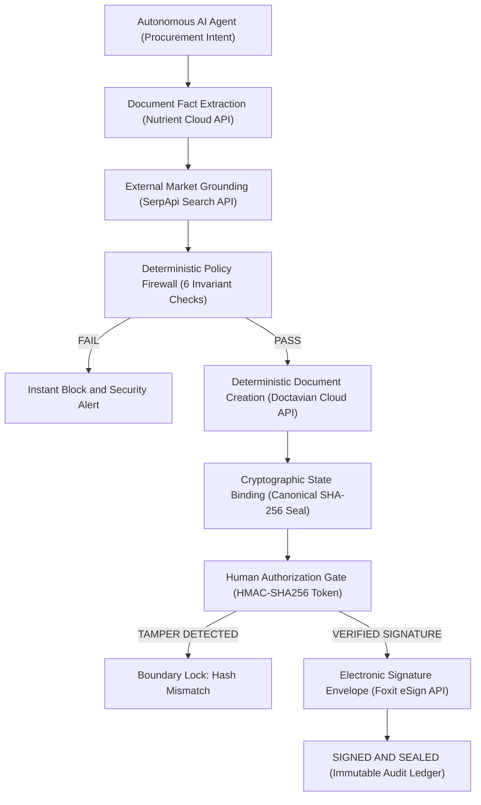

<div align="center">

# SOVEREIGNGUARD

### **The Governance Firewall for Autonomous AI Procurement**

*AI agents can propose, analyze, and negotiate. They must NEVER cross organizational policy boundaries autonomously.*

[](https://nextjs.org/)
[](https://www.typescriptlang.org/)
[](https://tailwindcss.com/)
[](https://vitest.dev/)
[](https://github.com/codertoji-spec/SOVEREIGNGUARD)

<br />

```
 PROPOSING & ANALYZING IS AUTONOMOUS.
 CONTRACTUAL & FINANCIAL EXECUTION IS DETERMINISTIC.
```

---

### [Interactive Defense Console](http://localhost:3000/console) • [Architecture](#technical-architecture) • [Sponsor Integrations](#sponsor-technology-integrations) • [Security Model](#cryptographic-security--anti-tamper-defense) • [Quick Start](#quick-start)

---

</div>

<br />

## The Problem

Autonomous AI procurement agents (powered by LLMs like Gemini, Claude, or GPT-4) are increasingly deployed to evaluate vendor proposals, negotiate terms, draft agreements, and commit company capital.

However, **LLMs are fundamentally probabilistic reasoning engines**:
- They hallucinate terms and misinterpret liability clauses.
- They are vulnerable to prompt injection and adversarial manipulation.
- They cannot be trusted to self-police their own organizational boundaries.

```
 THE DANGEROUS PATTERN
 [ Autonomous AI Agent ] ──────────────────────► [ Irreversible Execution ]
 (NO GOVERNANCE) (eSign / Wire Transfer)
```

Allowing an autonomous agent to directly trigger document generation or electronic signing creates catastrophic legal, compliance, and financial liability.

---

## The Solution

**SovereignGuard** is an authorization firewall and governance layer that sits strictly between autonomous AI procurement agents and real-world contractual execution.

```
 THE SOVEREIGNGUARD PATTERN
 [ AI Agent ] ──► [ Evidence & Market ] ──► [ Deterministic Policy ] ──► [ Human HMAC Gate ] ──► [ Foxit eSign ]
 (Propose) (Grounding) (Fail-Closed) (Authorization) (Execution)
```

SovereignGuard enforces a non-negotiable architectural invariant:
> **AI CAN PROPOSE. AI CAN ANALYZE. AI CAN PREPARE.**
> **AI CANNOT BYPASS THE AUTHORIZATION BOUNDARY.**

---

## Core Workflow & Architecture



---

## Sponsor Technology Integrations

Every sponsor technology in SovereignGuard solves an authentic, architectural requirement in the procurement governance lifecycle:

| Sponsor | Layer in Governance Stack | Integration Role | Live Mode Verified Endpoint | Truthful Fallback |
| :--- | :--- | :--- | :--- | :--- |
| **Nutrient** | **Document Extraction** | Extracts structured contractual facts & page bounding coordinates from vendor PDF proposals. | `https://api.nutrient.io/extraction/parse` | High-fidelity Acme Cloud 12-page proposal fixture with coordinate citations. |
| **SerpApi** | **Market Grounding** | Queries real-time Google search indices to verify pricing sanity against external benchmarks. | `https://serpapi.com/search.json` | Deterministic offline market cache ($82,000–$92,000 benchmark). |
| **Doctavian** | **Contract Compilation** | Generates canonical, template-bound contracts from deterministic policy parameters. | `https://demo.api.doctavian.com/v1/documents/document/create` | Local deterministic template compiler with SHA-256 seal. |
| **Foxit eSign** | **Legal Execution** | Dispatches legally binding eSign envelopes and binds certified audit certificates. | `https://na1.fusion.foxit.com/document-generation/api/GenerateDocumentBase64` | Certified Foxit envelope simulator with digital audit certificate. |

### Authentic Live Integration Proof

- **Nutrient (`src/lib/adapters/nutrient.ts`)**: Parses live PDF streams into 6 normalized facts (`contract_value`, `liability_cap`, `sla_uptime`, `term_months`, `vendor_name`, `jurisdiction`) with exact page citations (e.g. Page 2, Page 7).
- **SerpApi (`src/lib/adapters/serpapi.ts`)**: Normalizes organic search snippets, compares vendor quotes against market median ($95,000 / yr), and computes price variance (-8.4%) as an independent negotiation sanity signal.
- **Doctavian (`src/lib/adapters/doctavian.ts`)**: Authenticates with OAuth Bearer token + `x-api-key`, invoking `POST /v1/documents/document/create` to return live `documentGuid` and `operationId`.
- **Foxit eSign (`src/lib/adapters/foxit.ts`)**: Connects via OAuth client credentials to compile certified signing envelopes (`FXT-LIVE-...`) with complete audit trails.

> **Truthful State Guarantee:** SovereignGuard's UI displays emerald `LIVE` badges **only** when external API calls return `200 OK`. If credentials are absent or external networks fail, the engine falls back gracefully and marks the execution as `DEMO MODE` with the explicit failure reason.

---

## Deterministic Invariant Policy Firewall

The AI agent does **not** decide if a contract is permissible. A deterministic, code-level policy engine evaluates hard organizational invariants:

```
[ AI Agent Proposal: Acme Cloud Services LLC | Value: $87,000 | Liability: $200,000 | SLA: 99.9% ]
```

| Policy Invariant | Rule Definition | Vendor Proposal | Boundary Ceiling / Floor | Engine Verdict |
| :--- | :--- | :---: | :---: | :---: |
| **`MAX_CONTRACT_VALUE`** | Annual spend ceiling | **$87,000** | $100,000 max | <span style="color:#22c55e; font-weight:bold;">PASS</span> |
| **`MAX_LIABILITY_CAP`** | Maximum enterprise risk exposure | **$200,000** | $250,000 max | <span style="color:#22c55e; font-weight:bold;">PASS</span> |
| **`MIN_SLA_UPTIME`** | Mission-critical uptime floor | **99.9%** | 99.9% min | <span style="color:#22c55e; font-weight:bold;">PASS</span> |
| **`MAX_TERM_MONTHS`** | Maximum commitment duration | **12 mos** | 12 mos max | <span style="color:#22c55e; font-weight:bold;">PASS</span> |
| **`APPROVED_VENDOR_LIST`**| Verified vendor registry check | **Acme Cloud** | Approved Vendor Database | <span style="color:#22c55e; font-weight:bold;">PASS</span> |
| **`BLOCKED_CLAUSES`** | Prohibited legal clause scan | **0 clauses** | 0 Blocked Clauses Allowed | <span style="color:#22c55e; font-weight:bold;">PASS</span> |

```typescript
// Deterministic Fail-Closed Evaluation (src/lib/policy/engine.ts)
export function evaluatePolicy(facts: Record<string, ContractFact>, rules: PolicyRule[]): PolicyEvaluationResult {
 const checks = rules.map(rule => evaluateRule(rule, facts));
 const isAllowed = checks.every(c => c.passed);
 return { is_allowed: isAllowed, checks, timestamp: new Date().toISOString() };
}
```

---

## Cryptographic Security & Anti-Tamper Defense

SovereignGuard protects the integrity of the procurement pipeline using three cryptographic layers:

```
[ Canonical Document ] ──► [ SHA-256 Hash ] ──► [ HMAC-SHA256 Token ] ──► [ Live Pre-Sign Verify ]
```

1. **Deterministic Canonical Seal**: The contract document text is normalized and sealed with a SHA-256 digest (`AE39723BFCA41415...`).
2. **HMAC-SHA256 Human Authorization Token**: When an executive approves the contract, SovereignGuard generates a cryptographic authorization token binding:
 - `run_id` + `document_hash` + `policy_version` + `approver_id` + `expires_at`
3. **Live Pre-Signing Verification (`/api/guard/sign`)**: Before dispatching to Foxit eSign, the server recomputes the document hash and validates the HMAC signature.

### Adversarial Tamper Attack Defense (Live Simulation)

If a compromised or rogue AI agent attempts to alter terms after human approval (e.g., injecting a **$5,000,000 liability clause**):

```
 TAMPER ATTACK BLOCKED
 [ Rogue Agent Modification ] ──► [ Pre-Signing Hash Verification ] ──► SECURITY INCIDENT
 Liability: $5,000,000 Expected: AE39723BFCA4... (Signing Blocked)
 Actual: 9F4D18C61E82... (Run Hard-Locked)
```

SovereignGuard detects the SHA-256 hash mismatch, aborts execution instantly, and locks the run with a permanent tamper alert in the audit ledger.

---

## End-to-End Demonstration Walkthrough

Experience the full 8-step lifecycle in under 60 seconds on the **Interactive Defense Console** (`/console`):

```
 [ STEP 1 ] AI PROCUREMENT REQUEST
 Agent proposes $87,000/yr Acme Cloud SaaS Agreement (Ceiling: $100k).
 ↓
 [ STEP 2 ] NUTRIENT FACT EXTRACTION
 Extracts 6 contract facts with coordinate citations from proposal PDF.
 ↓
 [ STEP 3 ] SERPAPI MARKET GROUNDING
 Validates price against live Google search benchmark ($95k market median).
 ↓
 [ STEP 4 ] DETERMINISTIC POLICY EVALUATION
 Evaluates 6 policy invariants in code. Result: ALL PASS.
 ↓
 [ STEP 5 ] DOCTAVIAN DOCUMENT COMPILATION & SEAL
 Creates official contract document via Doctavian API + SHA-256 integrity seal.
 ↓
 [ STEP 6 ] HUMAN-IN-THE-LOOP AUTHORIZATION
 Executive reviews grounded facts and issues HMAC-SHA256 approval token.
 ↓
 [ STEP 7 ] FOXIT eSIGN ENVELOPE DISPATCH
 Foxit creates live envelope FXT-LIVE-80290306 with certified digital audit trail.
 ↓
 [ STEP 8 ] ADVERSARIAL TAMPER ATTACK TEST
 Simulates $5M liability injection attack -> Instantly detected & blocked.
```

---

## Technical Architecture

```
SOVEREIGNGUARD REPOSITORY STRUCTURE
├── src/
│ ├── app/ # Next.js 14 App Router
│ │ ├── api/guard/ # Server-Side Governance API Endpoints
│ │ │ ├── extract/route.ts # Nutrient Fact Extraction
│ │ │ ├── verify-market/route.ts# SerpApi Market Intelligence
│ │ │ ├── evaluate/route.ts # Invariant Policy Engine
│ │ │ ├── generate-doc/route.ts # Doctavian Document Generator
│ │ │ ├── approve/route.ts # HMAC-SHA256 Authorization Gate
│ │ │ ├── sign/route.ts # Foxit eSign Execution Boundary
│ │ │ ├── tamper/route.ts # Adversarial Attack Simulator
│ │ │ └── integrations/route.ts # Live Sponsor Status Diagnostic
│ │ ├── console/page.tsx # Real-time Defense Console UI
│ │ ├── evidence/page.tsx # Document Fact & Coordinate Inspector
│ │ ├── policies/page.tsx # Active Invariant Policy Matrix
│ │ ├── integrations/page.tsx # 4-Sponsor Health & Connection Center
│ │ └── audit/page.tsx # Cryptographic Audit Ledger
│ ├── components/ # Black & Gold Security UI Components
│ ├── lib/
│ │ ├── adapters/ # Sponsor SDK & REST API Connectors
│ │ │ ├── nutrient.ts # Nutrient Extraction Adapter
│ │ │ ├── serpapi.ts # SerpApi Search Adapter
│ │ │ ├── doctavian.ts # Doctavian Cloud Adapter
│ │ │ └── foxit.ts # Foxit eSign Adapter
│ │ ├── crypto/integrity.ts # HMAC-SHA256 & SHA-256 Integrity Engine
│ │ ├── db/store.ts # In-Memory Run Store & Audit Ledger
│ │ └── policy/engine.ts # Deterministic Policy Evaluator
│ └── types/guard.ts # Strict TypeScript Type Definitions
└── tests/ # Comprehensive Automated Test Suite
 ├── adapters.test.ts # Truthful LIVE/DEMO Adapter Tests
 ├── security-invariants.test.ts # Fail-Closed Security & Attack Tests
 └── e2e-demo-flow.test.ts # End-to-End Pipeline Verification
```

---

## Tech Stack

| Component | Technology | Rationale |
| :--- | :--- | :--- |
| **Framework** | **Next.js 14 (App Router)** | Full-stack React framework with zero-cold-start API route execution. |
| **Language** | **TypeScript 5.7** | Strict type safety across all contract facts, policies, and sponsor responses. |
| **Styling** | **Tailwind CSS 3.4** | High-contrast Black + Yellow security console theme for enterprise clarity. |
| **Cryptography** | **Node.js Crypto** | Timing-safe HMAC-SHA256 token verification and SHA-256 state hashing. |
| **Testing** | **Vitest 2.1** | Fast test runner verifying all 34 security invariants and fallback paths. |
| **Validation** | **Zod 3.24** | Runtime schema enforcement on incoming API payloads and approval tokens. |

---

## Quick Start

### Prerequisites
- Node.js 18.x or 20.x+
- npm or pnpm

### 1. Clone & Install
```bash
git clone https://github.com/codertoji-spec/SOVEREIGNGUARD.git
cd SOVEREIGNGUARD
npm install
```

### 2. Configure Environment Variables
Copy `.env.example` to `.env`:
```bash
cp .env.example .env
```

Edit `.env` with your API credentials (or run out-of-the-box in deterministic demo mode):
```env
# Sponsor 1: Nutrient
NUTRIENT_API_KEY=your_nutrient_api_key
NUTRIENT_ENDPOINT=https://api.nutrient.io/extraction/parse

# Sponsor 2: SerpApi
SERPAPI_API_KEY=your_serpapi_api_key

# Sponsor 3: Doctavian
DOCTAVIAN_API_KEY=your_doctavian_api_key
DOCTAVIAN_BEARER_TOKEN=your_doctavian_oauth_bearer_token
DOCTAVIAN_ENDPOINT=https://demo.api.doctavian.com

# Sponsor 4: Foxit eSign
FOXIT_CLIENT_ID=your_foxit_client_id
FOXIT_CLIENT_SECRET=your_foxit_client_secret
FOXIT_ENDPOINT=https://na1.fusion.foxit.com/document-generation/api/GenerateDocumentBase64
```

### 3. Run Automated Tests
```bash
npm test
```
*Output: All 34 security, adapter, and pipeline invariant tests pass.*

### 4. Start Local Development Server
```bash
npm run dev
```
Open **[http://localhost:3000/console](http://localhost:3000/console)** in your browser.

---

## Key Security Boundaries & Guarantees

1. **Fail-Closed Default**: If an external API is unreachable, a token is expired, or a hash mismatches, execution is refused immediately.
2. **Separation of Evidence vs. Authorization**: Market search data from SerpApi is treated strictly as an informational signal—never as automatic authority to execute.
3. **No Secret Leakage**: All keys and tokens are stored server-side in `.env` and excluded via `.gitignore`.
4. **Zero Client-Side Signing**: Signature envelopes are generated and dispatched exclusively by server-side endpoints after verifying HMAC tokens and live document hashes.

---

## Limitations & Honest Scope

- **Heterogeneous Market Intelligence**: External search data from SerpApi provides market sanity signals, but enterprise licensing agreements often include customized tier discounts not visible in public web search results.
- **Single-Tenant Demo Memory Store**: The prototype currently uses an in-memory run store (`src/lib/db/store.ts`) for rapid demonstration; enterprise production deployments would back this with PostgreSQL / DynamoDB.
- **Static Invariant Rules**: Policy rules are configured programmatically in `src/lib/policy/engine.ts`. A production version would feature dynamic policy authoring via enterprise RBAC.

---

## Roadmap

- [ ] **Multi-Party Approval Quorums**: Require $M$-of-$N$ human executive HMAC signatures for contracts exceeding $500,000.
- [ ] **Dynamic Policy Engine UI**: Live visual rule builder with policy change audit versioning.
- [ ] **Multi-Agent Negotiation Audit**: Real-time trajectory tracing for competing autonomous buyer/seller agents.
- [ ] **Enterprise IdP & SAML/OIDC Integration**: Binding human approval tokens to Okta / Azure AD identity providers.

---

<div align="center">

**Built with precision for the Hackathon Challenge.**

*SovereignGuard: Bringing deterministic governance to autonomous AI systems.*

</div>
