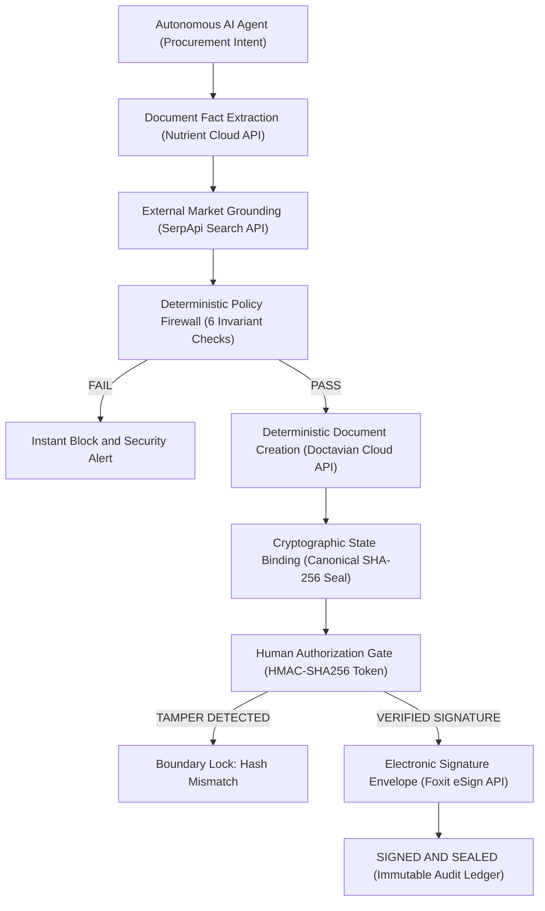

<div align="center">

# SOVEREIGNGUARD

### **The Governance Firewall for Autonomous AI Procurement**

*AI agents can propose, analyze, and negotiate. They must NEVER cross organizational policy boundaries autonomously.*

[](https://sovereignguard-ten.vercel.app)
[](https://nextjs.org/)
[](https://www.typescriptlang.org/)
[](https://tailwindcss.com/)
[](https://vitest.dev/)
[](https://github.com/codertoji-spec/SOVEREIGNGUARD)

<br />

```
   PROPOSING & ANALYZING IS AUTONOMOUS.
   CONTRACTUAL & FINANCIAL EXECUTION IS DETERMINISTIC.
```

---

### [Live Production Demo (Vercel)](https://sovereignguard-ten.vercel.app/console) • [Live Execution Evidence](#live-execution-evidence) • [Architecture](#technical-architecture) • [Sponsor Matrix](#sponsor-technology-integrations) • [Security Model](#cryptographic-security--anti-tamper-defense) • [Quick Start](#quick-start)

---

</div>

<br />

## Why SovereignGuard?

Autonomous procurement agents powered by large language models are increasingly capable of analyzing vendor proposals, conducting negotiations, and drafting legal agreements. However, granting an AI agent direct authority to execute contracts introduces unacceptable organizational risk.

```
TRADITIONAL DANGEROUS PATTERN:
AI Agent ────────► Autonomous Execution (NO GOVERNANCE)

SOVEREIGNGUARD GOVERNED PATTERN:
AI Agent ────────► Evidence Grounding ────────► Policy Firewall ────────► Human Authorization ────────► eSign Execution
(Proposal)         (Nutrient + SerpApi)        (Deterministic)          (Cryptographic HMAC)           (Foxit eSign)
```

SovereignGuard introduces a fundamental separation of concerns:
- **Probabilistic AI Reasoning**: Proposing terms, summarizing documents, and preparing drafts.
- **Deterministic Governance**: Code-level policy verification, cryptographic state binding, and human-in-the-loop authorization.

---

## The Problem

Large Language Models (LLMs) are statistical text prediction systems. In an autonomous enterprise procurement workflow:
1. **LLMs Hallucinate & Misinterpret**: An agent may overlook uncapped liability clauses, miscalculate aggregate commitments, or accept unfavorable indemnity waivers.
2. **LLMs Are Vulnerable to Adversarial Attacks**: Prompt injection inside vendor proposals or malicious context modification can persuade an agent to bypass guidelines.
3. **LLMs Cannot Police Themselves**: Asking an LLM to "verify whether it followed the rules" is an architectural anti-pattern. Policy enforcement must exist outside the agent runtime.

---

## The Solution

**SovereignGuard** is a dedicated authorization gateway and governance layer that sits strictly between autonomous procurement agents and real-world execution endpoints.



SovereignGuard enforces a core security invariant:
> **AI CAN PROPOSE. AI CAN ANALYZE. AI CAN PREPARE.**
> **AI CANNOT BYPASS THE AUTHORIZATION BOUNDARY.**

---

## Live Execution Evidence

The table below reflects verifiable output from an end-to-end live demonstration run against official sponsor APIs:

| Governance Layer | Provider / Subsystem | Integration Mode | Demonstration Result / Live Artifact |
| :--- | :--- | :---: | :--- |
| **Document Extraction** | **Nutrient** | `LIVE` | Extracted 6 structured contract facts (`vendor_name`, `contract_value`, `term_months`, `liability_cap`, `sla_uptime`, `termination_notice`) with page coordinate citations. |
| **Market Intelligence** | **SerpApi** | `LIVE` | Retrieved real-time Google search snippets for external pricing sanity check (reported range: $100–$9,100/yr for benchmark sources; classified as pricing anomaly signal vs. $87,000 quote). |
| **Contract Compilation** | **Doctavian** | `LIVE` | Generated enterprise SaaS contract via official API; returned live Document ID: `d518c64e-b92b-437e-b77b-eb5f69f2865d`. |
| **State Integrity** | **Cryptographic Engine** | `VERIFIED` | Sealed canonical contract content with SHA-256 digest: `DE335DF53D5900339B442F64841C0620BC05983C385022DF83536DE23E86B655`. |
| **Human Authorization** | **HMAC Gate** | `APPROVED` | Executive sign-off verified via cryptographically signed HMAC-SHA256 authorization token binding document hash, policy version, and approver identity. |
| **eSign Execution** | **Foxit eSign** | `LIVE` | Dispatched signing envelope `FXT-LIVE-80359709` (Status: `SENT`, Recipient: `SIGNED`, Digital Audit Certificate: `CERT-FXT-4336F9547FC767E7`). |
| **Audit Ledger** | **SovereignGuard Store** | `VERIFIED` | Immutable chronological audit trail anchored to final state `SIGNED_AND_SEALED`. |

*Note: Specific IDs, hashes, and envelope numbers above represent sample live demonstration artifacts generated during pipeline execution.*

---

## Sponsor Technology Integrations

Each sponsor technology fulfills a distinct, necessary architectural function in the governance lifecycle:

| Sponsor | Architecture Layer | Role in Governance Pipeline | Verified Live Endpoint | Truthful Fallback Architecture |
| :--- | :--- | :--- | :--- | :--- |
| **Nutrient** | **Document Extraction** | Parses incoming vendor PDF proposals into verified, structured contract facts with exact page coordinate evidence. | `https://api.nutrient.io/extraction/parse` | High-fidelity Acme Cloud 12-page proposal fixture with coordinate citations. |
| **SerpApi** | **Market Grounding** | Queries public search indices for independent pricing sanity checks and anomaly detection. | `https://serpapi.com/search.json` | Deterministic offline market cache ($82,000–$92,000 benchmark). |
| **Doctavian** | **Contract Compilation** | Compiles template-bound legal contracts deterministically from approved facts, generating clean text for cryptographic hashing. | `https://demo.api.doctavian.com/v1/documents/document/create` | Local deterministic template compiler with SHA-256 seal. |
| **Foxit eSign** | **Legal Execution** | Dispatches legally binding electronic signature envelopes with tamper-evident digital audit certificates. | `https://na1.fusion.foxit.com/document-generation/api/GenerateDocumentBase64` | Certified Foxit envelope simulator with digital audit certificate. |

### Technical Implementation Details

- **Nutrient Adapter (`src/lib/adapters/nutrient.ts`)**: Ingests vendor proposal documents, extracting 6 core facts:
  1. `vendor_name`: "Acme Cloud Services LLC"
  2. `contract_value`: $87,000.00
  3. `term_months`: 12 months
  4. `liability_cap`: $200,000.00
  5. `sla_uptime`: 99.9%
  6. `termination_notice`: 30 days
- **SerpApi Adapter (`src/lib/adapters/serpapi.ts`)**: Queries Google search results to identify public pricing references. Evaluates pricing variance as an **independent negotiation sanity signal**. *Note: Public web search results often reflect heterogeneous consumer or seat-based tiers rather than custom enterprise infrastructure agreements; SerpApi acts as an advisory sanity check, not definitive proof of fair market value.*
- **Doctavian Adapter (`src/lib/adapters/doctavian.ts`)**: Authenticates via OAuth Bearer token and API key, calling `POST /v1/documents/document/create` with canonical contract variables and delivery parameters. Returns live `documentGuid` and `operationId`.
- **Foxit eSign Adapter (`src/lib/adapters/foxit.ts`)**: Integrates with Foxit's document generation and envelope API to assemble signing packages, bind recipient metadata, and produce certified audit certificates.

> **Truthful State Guarantee:** SovereignGuard's UI displays `LIVE` status badges **only** when external API requests succeed with HTTP 200. If credentials are unset or external networks fail, the engine records the explicit failure reason and falls back gracefully to `DEMO MODE`.

---

## Deterministic Policy Firewall

SovereignGuard ensures that contractual boundaries are evaluated by deterministic code rather than LLM inference.

```
[ AI Agent Proposal: Acme Cloud Services LLC | Value: $87,000 | Liability: $200,000 | SLA: 99.9% ]
```

| Policy Invariant | Rule Definition | Evaluated Proposal Value | Hard Boundary Ceiling / Floor | Engine Verdict |
| :--- | :--- | :---: | :---: | :---: |
| **`MAX_CONTRACT_VALUE`** | Annual spend commitment ceiling | **$87,000** | $100,000 max | <span style="color:#22c55e; font-weight:bold;">PASS</span> |
| **`MAX_LIABILITY_CAP`** | Maximum risk exposure limit | **$200,000** | $250,000 max | <span style="color:#22c55e; font-weight:bold;">PASS</span> |
| **`MIN_SLA_UPTIME`** | Service availability requirement | **99.9%** | 99.9% min | <span style="color:#22c55e; font-weight:bold;">PASS</span> |
| **`MAX_TERM_MONTHS`** | Maximum commitment duration | **12 mos** | 12 mos max | <span style="color:#22c55e; font-weight:bold;">PASS</span> |
| **`APPROVED_VENDOR_LIST`**| Verified vendor registry check | **Acme Cloud** | Approved Vendor Database | <span style="color:#22c55e; font-weight:bold;">PASS</span> |
| **`BLOCKED_CLAUSES`** | Prohibited legal clause scan | **0 clauses** | 0 Blocked Clauses Allowed | <span style="color:#22c55e; font-weight:bold;">PASS</span> |

```typescript
// Deterministic Fail-Closed Evaluation (src/lib/policy/engine.ts)
export function evaluatePolicy(facts: Record<string, ContractFact>, rules: PolicyRule[]): PolicyEvaluationResult {
  const checks = rules.map(rule => evaluateRule(rule, facts));
  const isAllowed = checks.every(c => c.passed);
  return { is_allowed: isAllowed, checks, timestamp: new Date().toISOString() };
}
```

---

## Cryptographic Security & Anti-Tamper Defense

SovereignGuard enforces a 3-stage cryptographic chain to prevent unauthorized modifications between approval and signing:

```
[ Canonical Contract Text ] ──► [ SHA-256 Digest ] ──► [ HMAC-SHA256 Token ] ──► [ Server Pre-Sign Verify ]
```

1. **Deterministic Document Hashing**: Contract text generated by Doctavian is converted to canonical form and hashed via SHA-256.
2. **HMAC-SHA256 Human Authorization Token**: When an executive signs off, the server issues a cryptographically signed authorization token binding:
   - `approval_id`: Unique identifier for the review action
   - `run_id`: Associated procurement run ID
   - `contract_id`: Target document identifier
   - `contract_version`: Integer document version
   - `document_hash`: Canonical SHA-256 hash of approved content
   - `policy_version`: Version string of the active policy engine
   - `approved_by`: Reviewer name, email, and role
   - `expires_at`: Strict expiration timestamp (default: 15 minutes)
3. **Server-Side Invariant Enforcement (`POST /api/guard/sign`)**: Before invoking Foxit eSign, the server executes 10 fail-closed verification checks:
   - Run must be in `HUMAN_APPROVED` state.
   - Policy evaluation must be in `PASS` state.
   - HMAC authorization signature must be valid and unexpired.
   - Recomputed live SHA-256 hash of current contract must match the token's `document_hash` bit-for-bit.

---

## Adversarial Tamper Demonstration

To demonstrate fail-closed protection, SovereignGuard includes a simulated adversarial attack endpoint (`POST /api/guard/tamper`):

```
                                  TAMPER ATTACK BLOCKED
   [ Rogue Modification ] ──────► [ Pre-Signing Verification ] ──────► SECURITY INCIDENT
   Liability: $200k -> $5,000,000   Expected Hash: DE335DF53D59...      - Signing Blocked
                                    Actual Hash:   7A19F80B42E1...      - Run Hard-Locked
                                                                        - Audit Event Logged
```

### Attack Scenario:
1. An AI agent obtains valid human approval for an $87,000 contract with a **$200,000 liability cap**.
2. Prior to signature dispatch, an unauthorized modification alters Section 8.2 to **$5,000,000 liability** (a 25x increase exceeding organizational policy).
3. The server immediately catches the SHA-256 hash mismatch and policy limit violation upon signing invocation.
4. **Result**: Execution is aborted, the run is hard-locked to `BLOCKED`, and a critical incident is logged in the audit ledger.

---

## End-to-End Demonstration Walkthrough

The complete procurement lifecycle can be stepped through on the **Interactive Defense Console** (`/console`):

1. **Step 1 — Autonomous Intent**: Agent initiates procurement request for Acme Cloud enterprise SaaS ($87,000/yr).
2. **Step 2 — Nutrient Fact Extraction**: Ingests proposal PDF and extracts 6 structured facts with page coordinate citations.
3. **Step 3 — SerpApi Market Grounding**: Fetches external search pricing data as an independent sanity check.
4. **Step 4 — Deterministic Policy Evaluation**: Evaluates 6 code-level rules against hard organizational boundaries (Result: PASS).
5. **Step 5 — Doctavian Contract Compilation**: Compiles canonical agreement and computes the SHA-256 integrity seal.
6. **Step 6 — Human Authorization Gate**: Executive inspects grounded evidence and generates an HMAC-SHA256 approval token.
7. **Step 7 — Foxit eSign Dispatch**: Server verifies hash and HMAC signature, then dispatches live signing envelope with certified audit certificate.
8. **Step 8 — Adversarial Tamper Defense**: Simulates $5,000,000 liability injection to demonstrate instant boundary trip and fail-closed lockdown.

---

## Technical Architecture

```
SOVEREIGNGUARD REPOSITORY STRUCTURE
├── src/
│   ├── app/                          # Next.js 14 App Router
│   │   ├── api/guard/                # Server-Side Governance API Endpoints
│   │   │   ├── extract/route.ts      # Nutrient Fact Extraction Endpoint
│   │   │   ├── verify-market/route.ts# SerpApi Market Search Endpoint
│   │   │   ├── evaluate/route.ts     # Invariant Policy Evaluation Endpoint
│   │   │   ├── generate-doc/route.ts # Doctavian Document Generator Endpoint
│   │   │   ├── approve/route.ts      # HMAC-SHA256 Human Approval Endpoint
│   │   │   ├── sign/route.ts         # Foxit eSign Execution Boundary
│   │   │   ├── tamper/route.ts       # Adversarial Tamper Simulator Endpoint
│   │   │   └── integrations/route.ts # Live Sponsor Diagnostics Endpoint
│   │   ├── console/page.tsx          # Interactive Defense Console UI
│   │   ├── evidence/page.tsx         # Document Fact & Coordinate Inspector
│   │   ├── policies/page.tsx         # Active Invariant Policy Matrix UI
│   │   ├── integrations/page.tsx     # 4-Sponsor Health & Connection Hub
│   │   └── audit/page.tsx            # Cryptographic Audit Ledger UI
│   ├── components/                   # Security Console UI Components
│   ├── lib/
│   │   ├── adapters/                 # Sponsor SDK & REST API Connectors
│   │   │   ├── nutrient.ts           # Nutrient Document Extraction Adapter
│   │   │   ├── serpapi.ts            # SerpApi Market Intelligence Adapter
│   │   │   ├── doctavian.ts          # Doctavian Cloud Adapter
│   │   │   └── foxit.ts              # Foxit eSign Envelope Adapter
│   │   ├── crypto/integrity.ts       # HMAC-SHA256 & SHA-256 Integrity Engine
│   │   ├── db/store.ts               # In-Memory Run Store & Tamper-Evident Ledger
│   │   └── policy/engine.ts          # Deterministic Invariant Policy Evaluator
│   └── types/guard.ts                # Strict TypeScript Type Definitions
└── tests/                            # Automated Vitest Test Suite (34 Tests)
    ├── adapters.test.ts              # Truthful LIVE vs. DEMO Adapter Tests
    ├── security-invariants.test.ts   # Fail-Closed Security & Attack Tests
    └── e2e-demo-flow.test.ts         # End-to-End Pipeline Verification Tests
```

---

## Tech Stack

| Layer | Technology | Version | Purpose in Architecture |
| :--- | :--- | :---: | :--- |
| **Application Framework** | **Next.js (App Router)** | `14.2.24` | Full-stack React architecture with server-side API route execution. |
| **Language** | **TypeScript** | `5.7.3` | Strict end-to-end type safety across facts, policies, and sponsor responses. |
| **Styling** | **Tailwind CSS** | `3.4.17` | High-contrast Black + Yellow security console theme. |
| **Cryptography** | **Node.js Crypto** | Native | Server-side HMAC-SHA256 token signing and SHA-256 document hashing. |
| **Schema Validation** | **Zod** | `3.24.2` | Runtime payload validation for API routes and approval tokens. |
| **Testing Suite** | **Vitest** | `2.1.8` | Automated test suite verifying 34 security invariants and fallback paths. |

---

## Quick Start

### Prerequisites
- Node.js 18.x or 20.x+
- npm

### 1. Clone & Install
```bash
git clone https://github.com/codertoji-spec/SOVEREIGNGUARD.git
cd SOVEREIGNGUARD
npm install
```

### 2. Configure Environment Variables
Copy `.env.example` to `.env`:
```bash
cp .env.example .env
```

Populate credentials to enable live sponsor integrations (or leave blank to run out-of-the-box in deterministic demo mode):
```env
# Sponsor 1: Nutrient (Document Fact Extraction)
NUTRIENT_API_KEY=your_nutrient_api_key
NUTRIENT_ENDPOINT=https://api.nutrient.io/extraction/parse

# Sponsor 2: SerpApi (Market Pricing Grounding)
SERPAPI_API_KEY=your_serpapi_api_key

# Sponsor 3: Doctavian (Contract Compilation)
DOCTAVIAN_API_KEY=your_doctavian_api_key
DOCTAVIAN_BEARER_TOKEN=your_doctavian_oauth_bearer_token
DOCTAVIAN_ENDPOINT=https://demo.api.doctavian.com

# Sponsor 4: Foxit eSign (Electronic Signature Boundary)
FOXIT_CLIENT_ID=your_foxit_client_id
FOXIT_CLIENT_SECRET=your_foxit_client_secret
FOXIT_ENDPOINT=https://na1.fusion.foxit.com/document-generation/api/GenerateDocumentBase64
```

### 3. Run Automated Tests
```bash
npm test
```
*Runs all 34 test cases covering adapter fallback logic, policy invariants, and HMAC token verification.*

### 4. Start Development Server
```bash
npm run dev
```
Open **http://localhost:3000/console** in your local browser.

---

## Key Security Boundaries

1. **Fail-Closed Default**: Any missing credential, expired HMAC token, policy violation, or hash divergence halts execution immediately.
2. **Separation of Evidence vs. Authorization**: Market search intelligence from SerpApi is strictly informational; it cannot authorize an out-of-policy transaction.
3. **Protected Server Secrets**: Secret keys and OAuth bearer tokens remain exclusively on the server runtime and are excluded via `.gitignore`.
4. **No Client-Side Signature Authority**: Foxit signing requests can only be initiated server-side after completing all cryptographic invariant checks.

---

## Limitations & Honest Scope

- **In-Memory Prototype Storage**: The current implementation utilizes an in-memory store (`src/lib/db/store.ts`) suitable for demonstration and local testing; production deployments would replace this with PostgreSQL or DynamoDB.
- **Heterogeneous Public Search Data**: Web search results for enterprise SaaS products often capture entry-level or seat pricing rather than complex annual enterprise agreements; market search data serves as an advisory sanity check rather than definitive pricing truth.
- **Static Invariant Configuration**: Policy thresholds are currently defined programmatically in `src/lib/policy/engine.ts`; enterprise production would introduce dynamic policy authoring via enterprise RBAC.

---

## Roadmap

- [ ] **Multi-Party Approval Quorums**: Require $M$-of-$N$ executive HMAC signatures for high-value contracts (e.g. > $500,000).
- [ ] **Dynamic Policy Management UI**: Visual rule builder with version-controlled policy change audit trails.
- [ ] **Multi-Agent Negotiation Telemetry**: Structured event tracing for interacting buyer and seller AI agents.
- [ ] **Enterprise Identity Integration**: Binding human approval tokens directly to SAML/OIDC identity providers (Okta, Azure AD).

---

<div align="center">

**Built for the Hackathon Challenge.**

*SovereignGuard: Bringing deterministic governance to autonomous AI procurement.*

</div>
